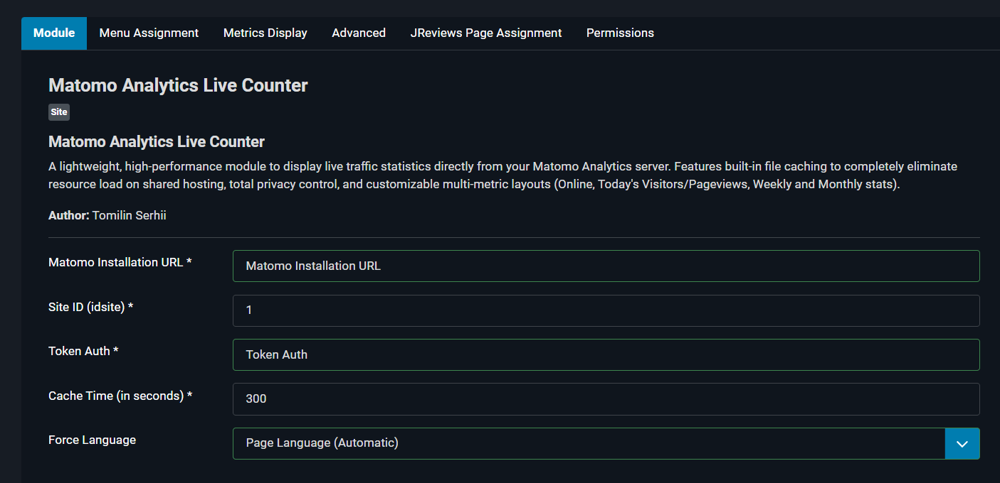
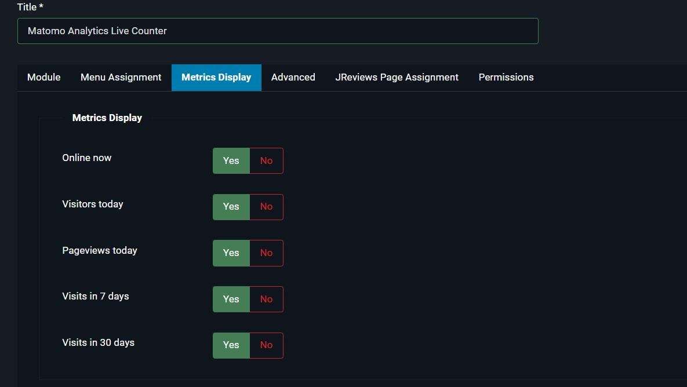

# Matomo Analytics Live Counter for Joomla 5

A lightweight, high-performance Joomla 5 module that displays live traffic statistics directly from your self-hosted or cloud Matomo Analytics server. 

This module is designed with shared hosting limitations in mind, utilizing a smart file-based caching system to eliminate redundant API requests and prevent server overhead.

---

## Visual Presentation

### 1. Frontend Module View
Here is how the clean, adaptive statistics block looks to your visitors (or admins) on the website frontend:


### 2. Administrator Interface & Settings
The module configuration includes deep integration with Joomla's multilingual features and flexible access rights:



Advanced display metrics configuration allows you to set visibility thresholds for each metric individually:



---

## Key Features

* **Real-Time Data:** Display "Online Now" visitors, daily unique users, today's pageviews, weekly, and monthly totals.
* **Zero Server Load (Smart Caching)** Features a file-based JSON cache. The module reads stats instantly from a local file, performing only **one** background API request per cache interval (e.g., every 5 minutes).
* **Native Multilingual Support:** Fully localized in English (en-GB), Ukrainian (uk-UA), and Russian (ru-RU). Supports automatic page language matching or forced language override.
* **Clean Design:** Lightweight HTML/CSS structure that seamlessly inherits your active Joomla template styling with dark-mode support.

---

## Technical Architecture

The module utilizes Joomla's internal API engine and Matomo's `API.getBulkRequest` to fetch all enabled metrics within a single, optimized POST cURL request.

```
[User Browser] ──> [Joomla 5 Website]
                          │
            (Is local JSON cache valid?)
             ├──> YES ──> [Read Cache File] ──> (Render HTML instantly)
             │
             └──> NO  ──> [Bulk API Request] ──> [Matomo Server]
                                                       │
                                               (Update Local Cache)
```

---

## Installation

1. Download the extension source files.
2. Zip the root directory containing `mod_matomo_counter.php`, `mod_matomo_counter.xml`, `/tmpl`, `/src`
 and `/language` into a single file named `mod_matomo_counter.zip`.
3. Log into your Joomla 5 Administrator Panel.
4. Navigate to **System** -> **Install** -> **Extensions**.
5. Upload the `.zip` package.


## Configuration

Go to **System** -> **Site Modules** and open **Matomo Live Counter**.

### Connection Settings:
* **Matomo Installation URL:** The absolute URL to your analytics suite (e.g., `https://analytics.your-site.com/`).
* **Site ID (idsite):** The numerical ID assigned to your website inside Matomo.
* **Token Auth:** Your secure Matomo API access token (`token_auth`), required to pull statistical data.
* **Cache Time:** Cache lifetime in seconds (Default: `300` seconds / 5 minutes).
* **Force Language:** Choose whether the module should adapt to the user's active language automatically or stay locked to a specific language.

### Metrics Display:
(Online, Today, Pageviews, Week, Month)  

### Menu Assignment:
Select "All Pages" (Or the pages you want). If this option is not set, the module may not appear on the frontend.

---

## Requirements

* Joomla! 5.x.x
* PHP 8.1 or higher
* PHP `cURL` extension enabled
* Matomo Analytics (Self-hosted or Cloud) with API access

## License

This project is open-source software licensed under the GNU General Public License v2 or later. See the `LICENSE.txt` file for full details.

## Author

Developed with ❤️ by **TommiLin**
