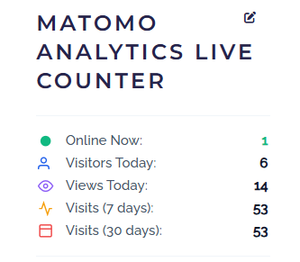
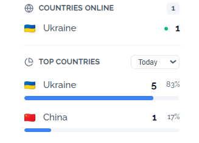
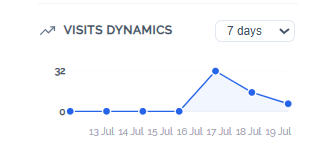
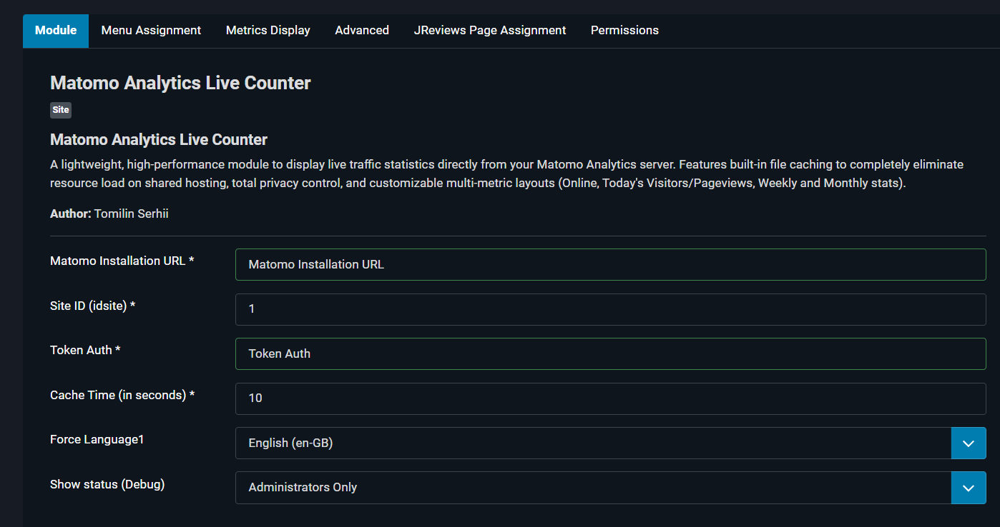
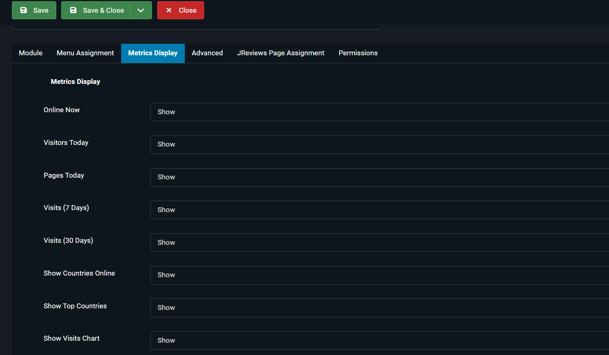
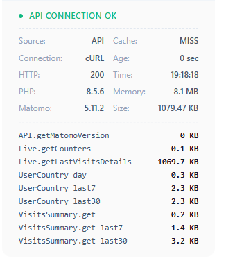

# Matomo Analytics Live Counter for Joomla 5

A lightweight, high-performance Joomla 5 module that displays live traffic statistics directly from your self-hosted or cloud Matomo Analytics server. 

This module is designed with shared hosting limitations in mind, utilizing a smart file-based caching system to eliminate redundant API requests and prevent server overhead.

---

## Visual Presentation

### 1. Frontend Module View
Here is how the clean, adaptive statistics block looks to your visitors (or admins) on the website frontend:

### 1. Main Indicators Card


### 2. Geographical Demographics & Interactive Charts



### 3. Core Administrative Control Panel



### 4. Advanced System Diagnostic Inspector (Debug Utility)


---

## Key Features

* **Real-time Live Statistics:** Display active visitors online right now, total visitors today, and pageviews today.
* **Historical Trends:** View accumulated statistics for the last 7 days and 30 days.
* **Geographical Insights:** 
  * **Countries Online:** Live indicator mapping current active sessions to country flags (via FlagCDN).
  * **Top Countries Tabbed Block:** Modern tabbed panel containing breakdown distributions by day, week, or month with animated percentage progress bars.
* **Interactive Dynamic Vector Chart (SVG):** Completely native SVG-rendered visit dynamics line chart supporting 7-day and 30-day view switching with zero heavy external JavaScript frameworks.
* **Advanced Intelligent Caching:** Built-in file caching mechanism preventing unnecessary API overhead and ensuring super-fast frontend loading speeds.
* **Advanced Debug Mode (Administrators Only Option):** Complete technical transparent overview layout checking API weights, HTTP statuses, response sizes, memory footprints, execution durations, and Matomo/PHP environment versions.
* **Granular Visibility Engine:** Toggle individual fields or entire sections on/off dynamically directly from the administrator control board.

---

## Technical Interface Overview

### 1. Main Indicators Card
A modern, minimalist widget component styling core tracking statistics with clean SVG graphics icons:
* **Online Now:** Real-time ping.
* **Visitors Today & Views Today:** Daily cumulative traffic overview.
* **7 Days / 30 Days:** Extended traffic context.

### 2. Geographical Demographics & Interactive Charts
* Displays active regional distributions and total localized counts.
* Provides native dropdown filters to inspect long-term territorial engagement weights.
* Renders seamless graphical visualizations of visit peaks with hover interactions.

### 3. Core Administrative Control Panel
* **Connection Strings:** Simple Matomo Base URL, Site ID (`idsite`), and API Secure `Token Auth` setups.
* **Caching Adjustments:** Fine-tune expiration periods in seconds to manage API payloads.
* **Display Controls:** Dedicated "Metrics Display" sub-panel allowing complete architectural toggling (`Show`/`Hide`) of individual sections depending on operational scopes.

### 4. Advanced System Diagnostic Inspector (Debug Utility)
* Live feedback testing connection metrics (`API CONNECTION OK` / `API CONNECTION ERROR`).
* Comprehensive payload mapping showing size allocations across internal methods (`Live.getLastVisitsDetails`, `UserCountry`, `VisitsSummary`).


## Technical Architecture

The module utilizes Joomla's internal API engine and Matomo's `API.getBulkRequest` to fetch all enabled metrics within a single, optimized POST cURL request.

```
[User Browser] ──> [Joomla 5 Website]
                          │
            (Is local JSON cache valid?)
             ├──> YES ──> [Read Cache File] ──> (Render HTML instantly)
             │
             └──> NO  ──> [Bulk API Request] ──> [Matomo Server]
                                                       │
                                               (Update Local Cache)
```

---

## Installation & Setup

1. **Download** the extension package zip file (`mod_matomo_counter.zip`).
2. Log into your Joomla Administrator panel and navigate to **System ➔ Install ➔ Extensions**.
3. Upload the zip package.
4. Navigate to **Site Modules**, locate **Matomo Analytics Live Counter**, and open its configuration.
5. Provide your **Matomo Installation URL**, **Site ID**, and **Token Auth**.
6. Switch to the **Metrics Display** tab to select which blocks you want to make visible on your site layout.
7. Publish the module into your preferred template module position.


## Configuration

Go to **System** -> **Site Modules** and open **Matomo Live Counter**.

### Connection Settings:
* **Matomo Installation URL:** The absolute URL to your analytics suite (e.g., `https://analytics.your-site.com/`).
* **Site ID (idsite):** The numerical ID assigned to your website inside Matomo.
* **Token Auth:** Your secure Matomo API access token (`token_auth`), required to pull statistical data.
* **Cache Time:** Cache lifetime in seconds (Default: `300` seconds / 5 minutes).
* **Force Language:** Choose whether the module should adapt to the user's active language automatically or stay locked to a specific language.

### Metrics Display:
(Online, Today, Pageviews, Week, Month)  

### Menu Assignment:
Select "All Pages" (Or the pages you want). If this option is not set, the module may not appear on the frontend.

---

## Requirements

* Joomla! 4.x / 5.x / 6.x (Ready)
* PHP 8.1 or higher
* PHP `cURL` extension enabled
* Matomo Analytics (Self-hosted or Cloud) with API access

## License

This project is open-source software licensed under the GNU General Public License v2 or later. See the `LICENSE.txt` file for full details.

## Author

Developed with ❤️ by **TommiLin**
